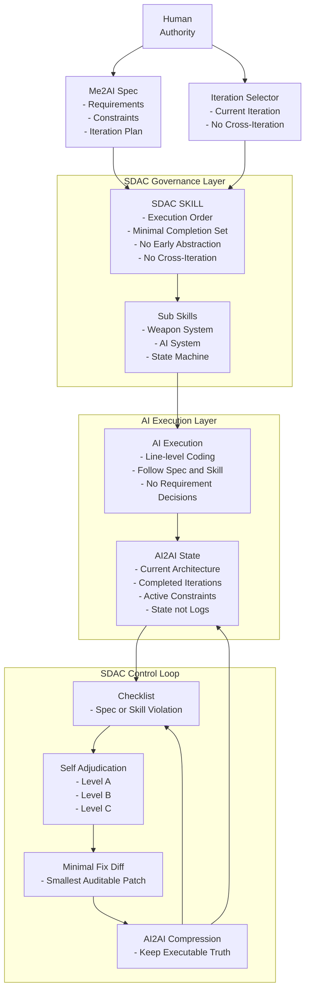

# SDAC Architecture

> **Spec-Driven AICoding（SDAC）架构图讲解**  
> 本文用于配合仓库中的 Mermaid 架构图，解释每一层的职责、数据流与控制闭环。

---

## 1. 架构图（Mermaid）

---

## 2. 一句话解释 SDAC

> **SDAC 的本质：在 AI 与代码之间插入一层“工程治理系统”，并用闭环机制持续把项目拉回“可执行真相”。**

---

## 3. 四层结构逐层讲解

### 3.1 Human Authority Layer（人类权力层）

**目标：把“意图”与“实现”彻底分离。**

包含两个输出：

- **Me2AI Spec（人类维护）**
  - Requirements：项目是什么、规则是什么
  - Constraints：不能做什么（技术/边界/禁区）
  - Iteration Plan：先做什么（迭代顺序）
- **Iteration Selector（当前迭代选择器）**
  - 指定当前迭代号
  - 强制“不跨迭代、不偷跑”

✅ 该层的产物是 **稳定、可版本化** 的文档，而不是对话语句。  
❌ 人类在 SDAC 中不做的事：逐行指挥代码、口头补需求、临场改架构。

---

### 3.2 SDAC Governance Layer（治理层）

**目标：把 AI 的自由度压缩到工程可控范围内。**  
这是 SDAC 与普通 AICoding 的根本差异。

包含两类规则：

- **SDAC SKILL（行为法律）**
  - 固定执行顺序（先读 Spec → 再实现 → 再写 AI2AI）
  - 强制最小可完成集（MCS）
  - 禁止跨迭代、禁止提前抽象、禁止“最佳实践”式重构
- **Sub Skills（系统边界）**
  - Weapon / AI / StateMachine 等
  - 每个子 Skill 定义：职责、交互方式、红线

✅ 治理层解决的是“AI 行为的可预测性”。  
换句话说：**不靠 AI 自觉，而靠制度约束。**

---

### 3.3 AI Execution Layer（AI 执行层）

**目标：AI 只做工程执行，不做需求决策。**

包含两块：

- **AI Execution**
  - 行级编码/实现
  - 只做当前迭代的最小实现
- **AI2AI State（AI 执行状态）**
  - Current Architecture：当前稳定架构事实
  - Completed Iterations：已完成迭代的事实摘要
  - Active Constraints：仍然有效的约束/假设
  - **State, not Logs**：AI2AI 是“状态快照”，不是“流水账”

✅ AI2AI 让项目“可继续”，避免 AI 只依赖对话记忆。  
❌ AI2AI 不能写：新需求、设计建议、未来规划、讨论过程。

---

### 3.4 SDAC Control Loop（控制闭环）

**目标：让 SDAC 能长期运行，且越跑越稳。**

闭环由四步组成：

1. **Checklist（违规检测）**
   - 判断：是否违反 Spec / SKILL / 子 Skill / 技术约束
2. **Self Adjudication（自我裁决）**
   - 分级：A/B/C
   - 决策：回滚策略（A 全回滚，B 回退最小集，C 就地修正）
3. **Minimal Fix Diff（最小修复 Diff）**
   - 先产出 unified diff（可审计、可回滚）
   - 修复顺序：删除 > 回退 > 替换 > 新增（仅必要时）
4. **AI2AI Compression（状态压缩）**
   - 删除历史噪音
   - 保留“当前可执行真相”
   - 防止长期项目膨胀与过期上下文误导

✅ 闭环把“纠偏”自动化，避免人类反复解释。  
✅ 闭环让项目具备工程级的 **可回滚性、可审计性、可持续性**。

---

## 4. 关键数据流与“真相来源”

### 真相来源（优先级）

1. **Me2AI Spec（最高）**
2. **SDAC SKILL / Sub Skills**
3. **AI2AI State**
4. **代码实现（最低）**

> 当出现冲突时，永远按照上述优先级回滚与修正。

---

## 5. 常见误区（阅读本图最容易误解的点）

- **误区 1：AI2AI 是日志**  
  正解：AI2AI 是状态快照，必须可压缩、可重写
- **误区 2：子 Skill 是“代码模板”**  
  正解：子 Skill 是职责边界与红线，不是实现指南
- **误区 3：Diff 模式会降低效率**  
  正解：Diff 提升可审计性与回滚效率，长期项目总体更快

---

## 6. 如何使用这张图（对外介绍话术）

如果你只讲 30 秒：

> SDAC 把 AI 当作工程执行单元，而不是智能开发者。  
> 人类只写 Spec，治理层约束 AI 行为，AI 负责行级实现。  
> 一旦跑偏，就通过 Checklist → 裁决 → 最小 Diff → 状态压缩 的闭环自动回正。  
> 这使得 AI Coding 变得可控、可审计、可长期运行。

---

## 7. 与仓库文件的对应关系

- `docs/whitepaper.md`：白皮书（含架构图）
- `docs/why-sdac.md`：Why SDAC（引言页）
- `spec/SKILL.md`：治理层的行为法律
- `spec/subskills/*`：子 Skill（系统边界）
- `spec/Skill_违规检测_Checklist.md`：Checklist
- `spec/AI_自我裁决模式.md`：裁决规则
- `spec/MinimalFixDiffMode.md`：最小 Diff 机制
- `spec/AI2AI_State_Compression.md`：AI2AI 压缩机制
- `spec/OneKey_Control_Prompt.md`：一键总控 Prompt

---
