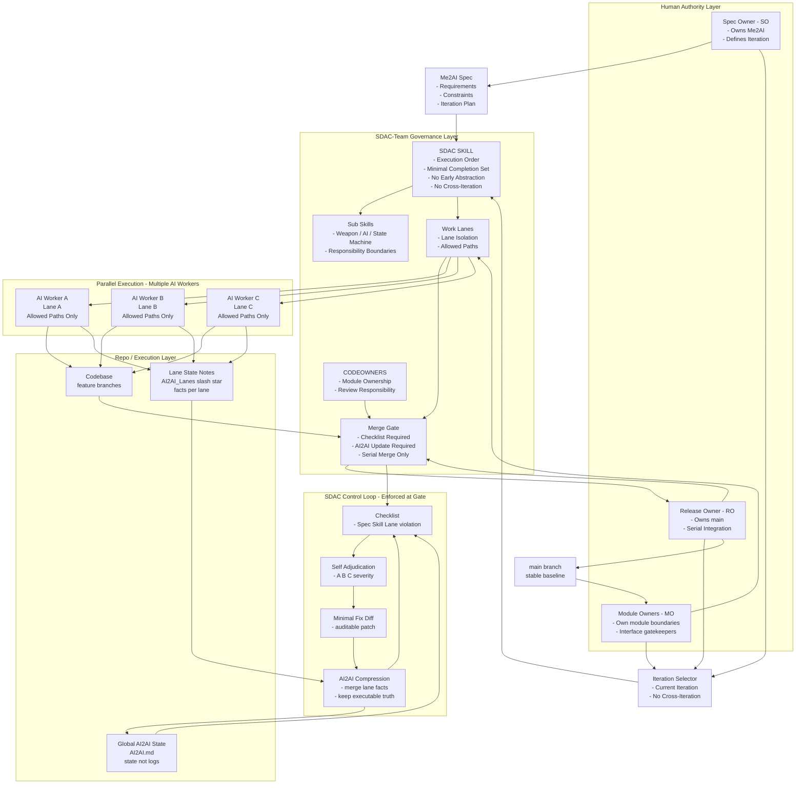
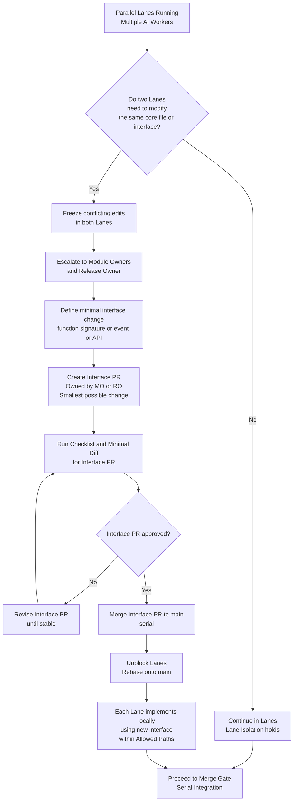
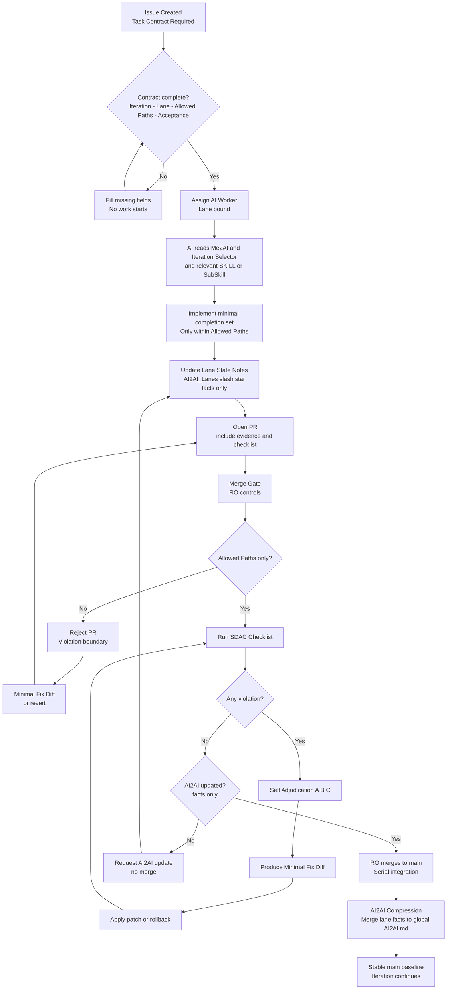
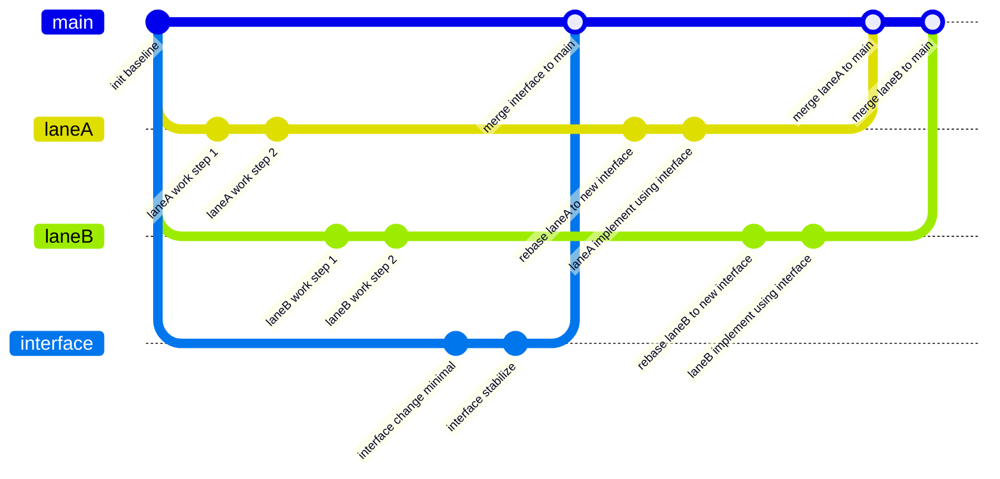
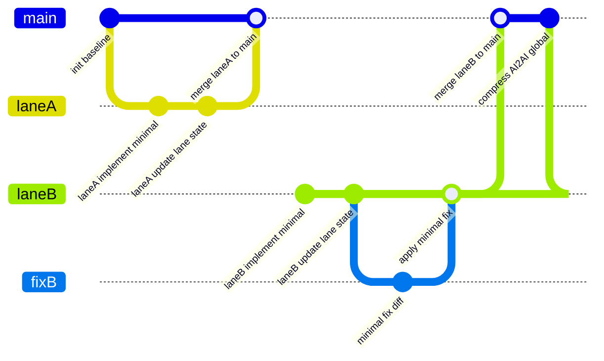

# SDAC-Team 实战白皮书

本文通过一个真实 repo 级案例，展示：
- 多人 + 多 AI 如何并行开发
- 为什么执行可以并行，但集成必须串行
- 违规如何被自动检测与回滚

结论：
**多 AI 失控不是必然，而是治理缺失的结果。**

## 1. SDAC-Team 架构图讲解

## 2. 并行开发冲突处理：并行 Lanes -> 先处理接口 PR

## 3. 并行开发冲突处理：接口 PR -> 再处理代码 PR

## 4. 并行开发冲突处理：接口 PR -> 再处理代码 PR 示例

## 5. PR 生命周期 GitFlow 示意图

