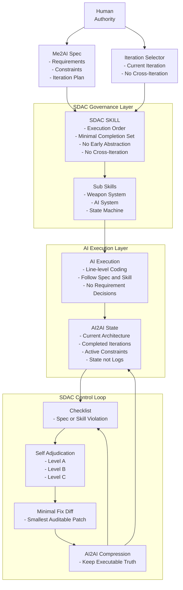

# Spec-Driven AICoding（SDAC）白皮书

> **Make AI Executable, Not Creative.**  
> 一套 **可控、可审计、可长期演进** 的 AI 协作工程方法论

---

## 0. 这份白皮书讲什么

SDAC（Spec-Driven AICoding）回答一个工程问题：

> 当 AI 参与写代码时，如何让它 **可控、可审计、可回滚，并能长期演进**？

本白皮书包含两部分：
- **方法论篇**：SDAC 的原则、结构与治理闭环
- **实战示例篇**：SDAC 在真实项目中的落地方式

---

## 1. SDAC 架构总览（Mermaid）

**图解一句话**：SDAC 在 AI 与代码之间插入一层 **工程治理系统**，并用控制闭环持续把项目拉回“可执行真相”。

---

# 方法论篇

## 2. 为什么需要 SDAC

当 AI 被直接用于写代码时，工程实践中反复出现：

- AI 擅自扩展需求、加入未被允许的“优化”
- 多轮对话后上下文漂移，项目状态不可追踪
- 产出不可审计，修改不可回滚
- 人类需要不断“纠正思路”，而不是推进进度

SDAC 的核心假设是：

> 问题不在于 AI 不够聪明，而在于 AI 没有被纳入工程治理体系。

---

## 3. 核心思想：用工程规则约束 AI

SDAC 不试图提升 AI 的创造性，而是通过工程化手段提升：

- 可预测性
- 可控性
- 可持续性

它把 AI 从“创作型助手”转化为：

> **受约束的工程执行单元**。

---

## 4. SDAC Spec 分权模型（Me2AI / AI2AI）

### 4.1 Me2AI（人类维护）

Me2AI 是人类向 AI 传递意图的唯一入口，包含：

- 需求描述（是什么）
- 技术约束（不能做什么）
- 迭代规划（先做什么）

特点：
- 最高优先级
- AI 只读
- 不涉及实现细节

---

### 4.2 AI2AI（AI 维护）

AI2AI 用于保存 AI 对项目“当前状态”的理解，包括：

- 当前稳定架构
- 已完成迭代的事实摘要
- 当前仍然有效的约束

关键原则：

> **AI2AI 是状态快照，而不是日志。**

---

## 5. SDAC SKILL：AI 的行为法律

SDAC SKILL 是 system-prompt 级别的最小规则集合，用于：

- 固定执行流程
- 禁止跨迭代
- 禁止提前抽象
- 强制最小可完成集

其本质不是“教 AI 怎么做”，而是：

> **定义 AI 绝对不能做什么。**

---

## 6. SDAC 子 Skill：复杂系统的职责边界

当系统复杂度提升，仅靠总 SKILL 不足以防止越权，因此引入子 Skill 约束具体系统，例如：

- Weapon System
- AI System
- State Machine

每个子 Skill 只回答三个问题：

1. 这个系统负责什么
2. 它如何与其他系统交互
3. 它绝对不能做什么

---

## 7. SDAC 治理闭环（Checklist × 裁决 × Diff × 压缩）

SDAC 通过四个机制形成闭环：

1. **违规检测 Checklist**：快速判断是否违规
2. **自我裁决**：自动分级并回滚
3. **Minimal Fix Diff**：以最小补丁方式修复，支持审计与回滚
4. **AI2AI 状态压缩**：长期防膨胀，删除历史噪音

结果是：
- 可审计
- 可回滚
- 可长期运行

---

## 8. 一句话总结（方法论）

> **SDAC = 把 AI 纳入工程治理体系的开发方法论。**

---

# 实战示例篇

## 9. 示例背景

项目类型：前端 Canvas 游戏

特点：
- 多系统（角色 / 武器 / AI / 状态机）
- 多轮长期迭代
- AI 负责行级编码

---

## 10. 示例 1：新增武器（弓）

### Me2AI 中的描述

- 目标：为主角增加弓武器
- 约束：
  - 使用攻击框判定
  - 弓只负责攻击行为

### AI 执行策略

启用：
- SDAC SKILL
- 子 Skill：Weapon System
- 子 Skill：State Machine

执行原则：
- 不引入新系统
- 不提前设计多武器管理器

### 若发生违规

AI 试图：在武器中加入自动寻敌逻辑

处理方式：
- 执行 Checklist → 命中 Weapon 越权
- 启用 Minimal Fix Diff → 删除寻敌逻辑，仅保留攻击判定

---

## 11. 示例 2：AI 行为跑偏

### 问题表现

- AI 直接 setVelocity
- 角色移动不再遵循加速度规则

### 处理流程

1. 执行 Checklist（命中 AI 越权）
2. 启用自我裁决（B 级）→ 回退到最小实现
3. 用 Minimal Fix Diff 替换为“加速度意图输出”

---

## 12. 示例 3：长期项目状态膨胀

### 问题

- AI2AI.md 超过 500 行
- AI 开始引用过期设计

### 解决

- 启用 AI2AI 状态压缩
- 重写为“当前稳定架构 + 已完成事实”
- 删除历史推导过程

---

## 13. 一句话总结（实战）

> **这不是让 AI 写代码，而是让 AI 按工程规则写代码。**
