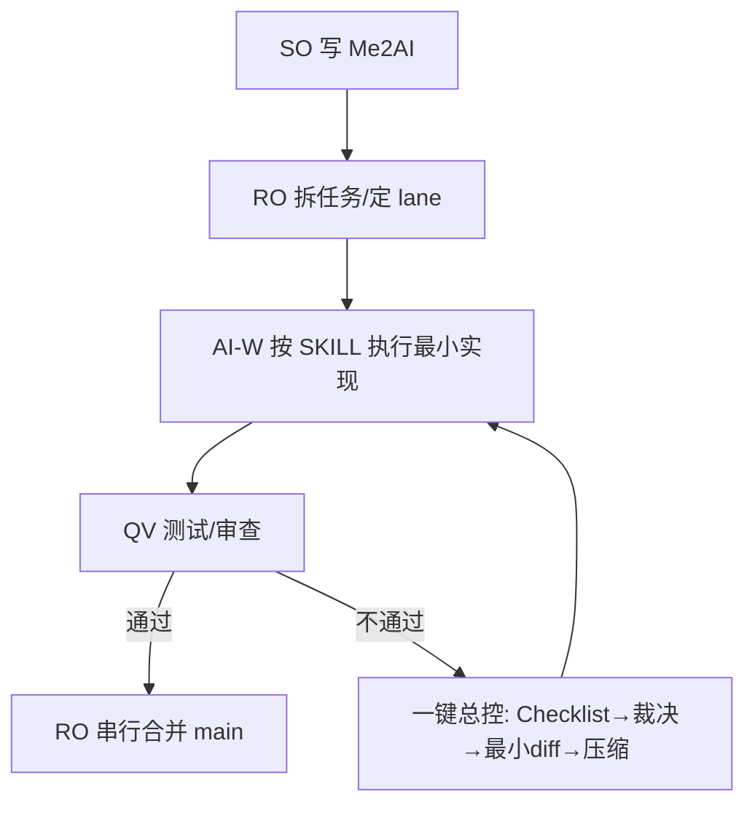

# Spec-Driven AICoding（SDAC）白皮书（中文）

> 目标：把 AI 变成“可执行的工程劳动力”，而不是“无限发挥的创意体”。

---

## 1. SDAC 解决什么问题

传统“Prompt 写代码”容易出现：

- 需求漂移：AI 自己加需求、优化、重构
- 状态膨胀：长对话后上下文污染，越修越乱
- 责任不清：多人 + 多 AI 并行时不可控
- 难验收：没有证据链，无法判断是否完成

SDAC 的核心是：**用 Spec 把 AI 的行为变成可验证、可回滚、可审计的工程流程**。

---

## 2. 双层 Spec：Me2AI / AI2AI

### 2.1 Me2AI（人类维护，最高优先级，只读）

- 需求描述（要什么、边界、非目标、验收口径）
- 技术约束（技术栈、禁止事项、工程约定）

### 2.2 AI2AI（AI 维护：事实状态 + 自约束）

- 当前稳定架构（事实）
- 已完成迭代摘要（事实）
- 当前有效约束（事实）
- 当前执行焦点（事实）

AI2AI 是“状态”，不是“日志”。

---

## 3. 治理工具链（让 AI 自己把自己拉回工程轨道）

- 违规检测 Checklist（A/B/C 分级）
- 自我裁决模式（A/B 回滚，C 进入最小修复）
- Minimal Fix Diff（先删除/回退/替换，最后才新增）
- AI2AI 状态压缩（长期项目防膨胀）
- 一键总控 Prompt（一次指令闭环治理）

对应文件：

- `spec/Skill_Violation_Checklist.md`
- `spec/AI_Self_Adjudication_Mode.md`
- `spec/Minimal_Fix_Diff_Mode.md`
- `spec/AI2AI_State_Compression.md`
- `spec/OneKey_Control_Prompt.md`

---

## 4. SDAC-Team（多人 + 多 AI 并行）

关键原则：

1) Me2AI 只允许 Spec Owner（SO）修改  
2) main 只允许 Release Owner（RO）合并  
3) 并行执行、串行集成  
4) Lane 隔离：AI Worker 只能改 Allowed Paths  
5) Gate 闸门：设计闸 / 实现闸 / 合并闸（每一闸都要证据）

详见：`spec-team/SDAC-Team.md`

---

## 5. 参考流程（Mermaid）

---

## 6. 为什么 SDAC 有效（工程视角）

- 把“讨论”变成“产物”：Spec / ADR / Diff / Evidence
- 把“长期对话”变成“可压缩状态”：AI2AI state
- 把“多 AI 并行”变成“责任明确、可回滚的流水线”：RACI + Gate + Lane

---

## 7. 下一步

如果你要引入多代理编排与共享记忆（可选）：

- 阅读：`docs/zh/claude-flow-pack.md`
- 直接使用本仓库提供的 workflow 模板：
  - `.claude/workflows/`
  - `tools/templates/claude-flow/workflows/`
